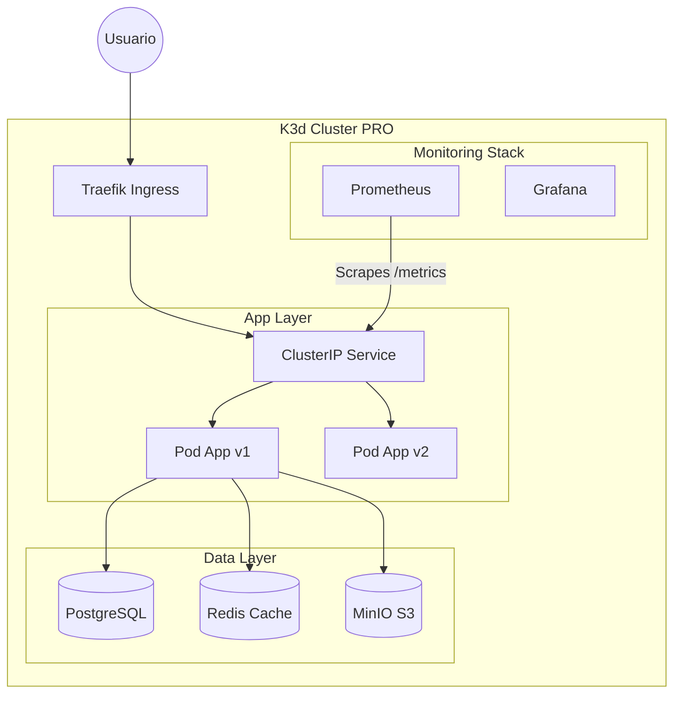

# K8s Fullstack Ops 🚀

Este proyecto implementa una arquitectura completa de despliegue de una aplicación Fullstack en Kubernetes (usando **k3d**), simulando un ciclo de vida real de DevOps con entornos de **Desarrollo (Dev)** y **Producción (Pro)**, Integración Continua (CI), Monitorización avanzada y pruebas automatizadas.

---

## 🏗️ Partes del Proyecto y Arquitectura

El sistema simula dos clusters físicos independientes aislando cargas de trabajo y datos.

### Componentes Principales
*   **Aplicación**: Python Flask API con soporte de métricas (Prometheus Client).
*   **Datos**:
    *   **PostgreSQL**: Base de datos relacional principal.
    *   **Redis** (Solo PRO): Caché para optimización de endpoints.
    *   **MinIO**: Almacenamiento de objetos S3-compatible.
*   **Plataforma**: 
    *   **K3d**: Orquestador Kubernetes ligero (Docker-in-Docker).
    *   **Ingress**: Traefik (nativo de K3d) para enrutamiento HTTP.
*   **Observabilidad**:
    *   **Prometheus Operator**: Recolección de métricas.
    *   **Grafana**: Visualización de dashboards.
    *   **AlertManager**: Reglas de alerta (ej. Baja disponibilidad).

### Diagrama de Arquitectura



---

## 🛠️ Guía de Setup y Pruebas

### Prerequisitos
*   Docker
*   K3d
*   Kubectl & Helm
*   Make
*   Python 3.10+ (para correr tests locales)

### Pasos de Instalación

1.  **Levantar Infraestructura Virtual**:
    ```bash
    make clusters
    # Crea 2 clusters: dev-cluster (puerto 8081) y prod-cluster (puerto 8080)
    ```

    > ⚠️ **Nota DNS**: Para que las URLs funcionen, asegúrate de añadir las siguientes entradas a tu fichero `/etc/hosts`:
    > ```text
    > 127.0.0.1 app.dev.localhost
    > 127.0.0.1 app.pro.localhost
    > ```

2.  **Desplegar Entorno DEV**:
    ```bash
    make deploy-dev
    # Despliega App + BD + MinIO + Monitorización
    ```
    *   🌐 **URL**: `http://app.dev.localhost:8081`

3.  **Desplegar Entorno PRO**:
    ```bash
    make deploy-pro
    # Despliega App + BD + Redis + MinIO + Monitorización (HA: 4 réplicas)
    ```
    *   🌐 **URL**: `http://app.pro.localhost:8080`

Para probar la persistencia o el cambio entre entornos, usa los comandos de contexto:
```bash
make switch-dev  # Cambia tu kubectl a DEV
make switch-pro  # Cambia tu kubectl a PRO
```

---

## 🧪 Tests Utilizados

El proyecto incluye una suite de **tests de integración** (ubicados en `tests/`) que validan la salud de la aplicación desde fuera del cluster, asegurando que todos los componentes (BD, Redis, API) responden correctamente.

### Ejecución
```bash
make test-dev  # Lanza pytest contra http://app.dev.localhost:8081
make test-pro  # Lanza pytest contra http://app.pro.localhost:8080
```

### Output Esperado
```text
🧪 Ejecutando tests contra entorno PRO...
============================= test session starts ==============================
platform darwin -- Python 3.10.12, pytest-7.4.0, pluggy-1.2.0
rootdir: /k8s-fullstack-ops
collected 4 items

tests/test_integration.py::test_health_check PASSED                    [ 25%]
tests/test_integration.py::test_database_connection PASSED             [ 50%]
tests/test_integration.py::test_redis_cache_hit PASSED                 [ 75%]
tests/test_integration.py::test_metrics_endpoint PASSED                [100%]

============================== 4 passed in 1.42s ===============================
```

---

## 📦 Uso de Makefile

El `Makefile` es el centro de control del proyecto. Aquí tienes los comandos más importantes:

### Ciclo de Vida
| Comando | Descripción |
| :--- | :--- |
| `make clusters` | Crea los clusters `dev` y `pro` en Docker. |
| `make clean` | Destruye ambos clusters y limpia recursos. |

### Despliegues
| Comando | Descripción |
| :--- | :--- |
| `make deploy-dev` | Construye imagen, la importa en Dev y despliega k8s manifests. |
| `make deploy-pro` | Igual que dev, pero con configuración de Producción (Redis, más réplicas). |

### Monitorización y Acceso
| Comando | Descripción |
| :--- | :--- |
| `make grafana-dev` | Abre túnel al Grafana de DEV. |
| `make grafana-pro` | Abre túnel al Grafana de PRO. |
| `make prometheus-dev` | Abre túnel al Prometheus de DEV. |
| `make prometheus-pro` | Abre túnel al Prometheus de PRO. |


### Utilidades
| Comando | Descripción |
| :--- | :--- |
| `make logs-dev` | Muestra logs de los pods de la app en Desarrollo. |
| `make switch-dev` | Cambia el contexto de tu terminal a Desarrollo. |
| `make logs-pro` | Muestra logs de los pods de la app en Producción. |
| `make switch-pro` | Cambia el contexto de tu terminal a Producción. |
